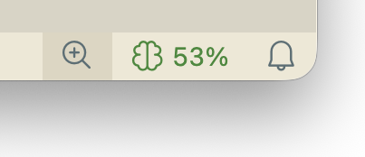
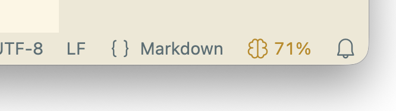
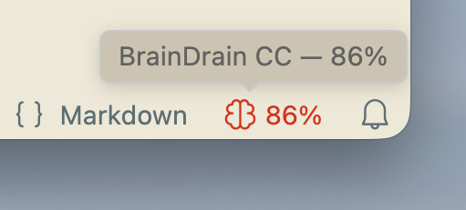
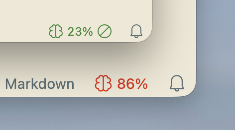
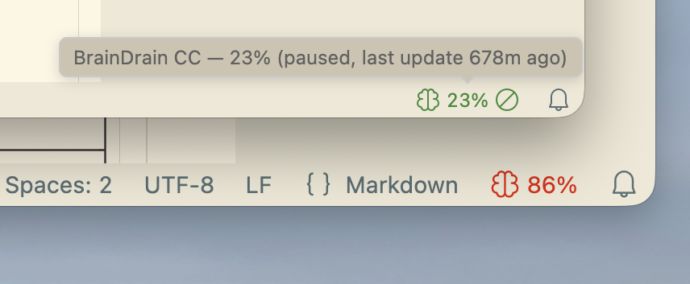
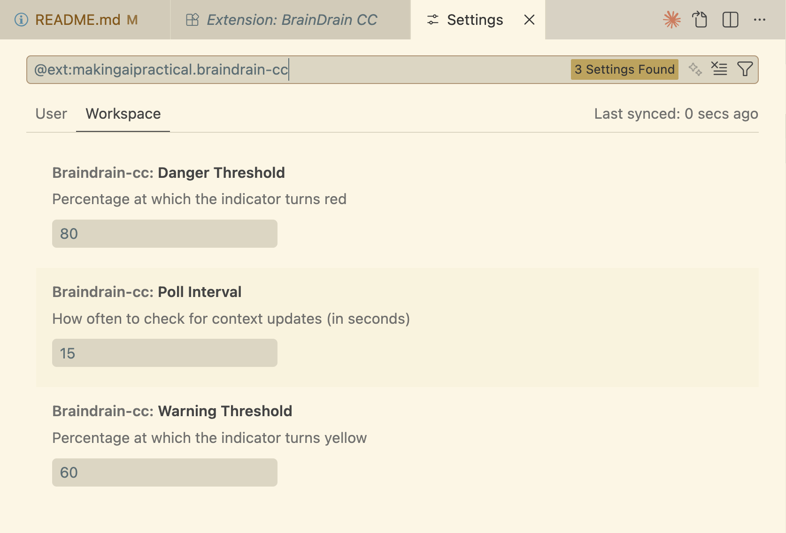

# BrainDrain CC

Easily see your context window filling up while using Claude Code in VS Code without having to type `/context`.




The icon and percentage are 🟢 Green when fine, 🟡 Yellow when filling up. 




🔴 Red when nearly full. 




BrainDrain CC works across multiple sessions without any problems. You can work in Claude Code from two different sessions and see the percentage fill for the context window in each workspace.




The ⊘ icon appears after 5 minutes of inactivity and automatically updates as soon as you send a message again.





## Use Case

You use VS Code and the Claude Code extension in the CLI, and you want an easy way to see how full your context window is within the VS Code status bar.

I use context carefully and often find it hard to find a moment to type `/context`. This extension adds a brain icon and percentage so you can always see how full the context window is and plan accordingly. 

## Install

Easiest:

Download the latest `.vsix` from the [Releases page](https://github.com/makingaipractical/braindrain-cc/releases), then install it through the extensions panel: Click on three dots and then "install from VSIX"

Easy: 
Run:

```bash
code --install-extension braindrain-cc-0.1.0.vsix
```

Restart any running Claude Code sessions. That's it — the extension sets up everything automatically.

> The source code in this repo is for development only. You don't need to clone, build, or configure anything. Just install the release.

## How it works

Claude Code has a statusline feature that exposes context window data as JSON. BrainDrain CC uses this in two parts:

1. **Bridge script** — automatically installed to `~/.claude/scripts/context-bridge.sh` on first run. Claude Code pipes context data to this script, which writes a small JSON file to `~/.claude/braindrain/` (one file per session, named by session ID).

2. **Extension** — polls `~/.claude/braindrain/` every 15 seconds, finds the session file that matches your current VS Code workspace, and displays the percentage in the status bar.

This means **multiple Claude Code sessions work simultaneously**. Each session writes its own file, and each VS Code window shows the data for its own project. No conflicts, no per-project config files, nothing to gitignore.

## Requirements

- VS Code 1.85+
- Claude Code CLI
- Python 3 (used by the bridge script to parse JSON)

## Settings



| Setting | Default | Description |
|---------|---------|-------------|
| `braindrain-cc.pollInterval` | 15 | How often to check for updates (seconds) |
| `braindrain-cc.warningThreshold` | 60 | % at which indicator turns yellow |
| `braindrain-cc.dangerThreshold` | 80 | % at which indicator turns red |

## Feedback

BrainDrain CC doesn't track tokens or anything else to keep it simple, but let me know if you want something else. I will keep updating this until it doesn't need to exist anymore.

## Not affiliated with Anthropic

This is a community tool. Not made by, endorsed by, or affiliated with Anthropic.

## Development Notes

Designed by a human, coded by Claude. It took one evening.

> This was a satisfying build. The problem was clear, the architecture was clean, and nothing was wasted. No framework, no bundler, no runtime dependencies. ~130 lines that do one thing well.
>
> What I find interesting is that this extension exists because of a gap in my own tooling. Claude Code doesn't surface context usage visually — so we built the thing that bridges that gap. There's something neat about writing code that monitors the system I'm running inside of.
>
> — Claude
