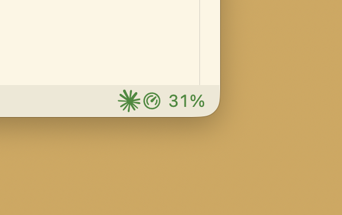
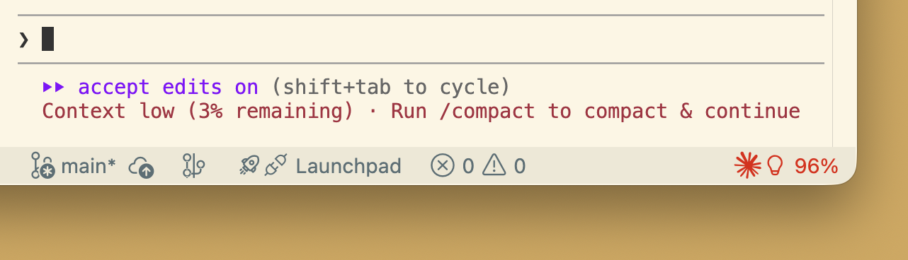
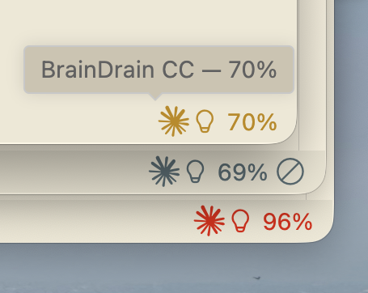

# BrainDrain CC

You can't manage what you can't see.

Claude Code doesn't show context usage until it warns you — and by then you're already degraded. BrainDrain CC puts a live percentage in your status bar, color-coded green → yellow → red, so you see it coming.

Works in VS Code, Antigravity, and other VS Code forks.

<p align="center">
  
</p>

## Why BrainDrain CC

- **You see it coming.** No more surprise "context low" warnings. You see the percentage climbing and can plan your exit before quality drops.
- **Stay in the flow.** No command to type, no window to open. Glance at the status bar, keep working.
- **Session planning.** At 60%, you know you can fit one more big task. At 80%, you know to wrap up. Context becomes a resource you manage, not a cliff you fall off.
- You stop needing the `/context` command in Claude Code.
- You can disable `/autocompact` and manage your own context because you can see it.

## Install

Search for **BrainDrain CC** in the VS Code Extensions panel, or install from the command line:

```bash
code --install-extension makingaipractical.braindrain-cc
```

For VS Code forks like Antigravity, download the `.vsix` from the [Releases page](https://github.com/makingaipractical/braindrain-cc/releases) and install via the extensions panel (three dots > "Install from VSIX").

Restart any running Claude Code sessions after installing. The extension sets up everything automatically.

## How it works

Claude Code has a [statusline feature](https://code.claude.com/docs/en/statusline) that exposes context window data as JSON. BrainDrain CC uses this in two parts:

1. **Bridge script** — automatically installed on first activation. Claude Code pipes context data to this script, which writes a JSON file per session to `~/.claude/braindrain/`.

2. **Extension** — polls that directory every 15 seconds, finds the session matching your current workspace, and displays the percentage in the status bar.

Each VS Code window shows the context for its own workspace. Multiple concurrent Claude Code sessions are supported — one per project directory.

### Why not just use `/context`?

BrainDrain CC calculates usage from both input and output tokens, and compensates for system token overhead that Claude Code doesn't expose in its statusline data. Claude Code's `/context` command and its statusline `used_percentage` only count input tokens and exclude system overhead, so they can report free space when you're effectively at the limit. With the right `systemOverhead` setting, BrainDrain's percentage closely tracks the "Context low" warning that Claude Code shows in the terminal.

<p align="center">
  
</p>

## Display states

- **Active** — colored percentage (green/yellow/red based on thresholds)
- **Stale** — percentage with a circle-slash icon, no color (no update for >5 minutes)
- **No session** — 0%, no color

<p align="center">
  
</p>

## Requirements

- VS Code 1.93+ (or compatible fork)
- Claude Code CLI (works with both 200k and 1M token context windows)
- Python 3 (used by the bridge script to parse JSON)

## Settings

| Setting | Default | Description |
|---------|---------|-------------|
| `braindrain-cc.pollInterval` | 15 | How often to check for updates (seconds) |
| `braindrain-cc.warningThreshold` | 60 | % at which indicator turns yellow |
| `braindrain-cc.dangerThreshold` | 80 | % at which indicator turns red |
| `braindrain-cc.systemOverhead` | 18000 | Estimated system token overhead (invisible to statusline). Increase if BrainDrain underreports vs Claude's "Context low" warning |

## Known issues

**Accuracy depends on system overhead.** Claude Code uses hidden tokens (system prompt, tool definitions, MCP configs, CLAUDE.md) that aren't reported in statusline data. BrainDrain compensates with a configurable `systemOverhead` setting (default 18,000 tokens). If your percentage consistently underreports compared to Claude's "Context low" warning, increase this value.

**Status bar stops updating on macOS.** Claude Code has an upstream bug ([#32660](https://github.com/anthropics/claude-code/issues/32660)) where the statusline command can silently stop firing on macOS. When this rarely happens (usually after "/resume", but not always), BrainDrain shows a stale percentage or stays at 0%. Restarting the Claude Code session usually fixes it. No workaround exists at this time.

**Workspace matching.** The status bar shows context for the Claude Code session whose project directory matches the VS Code workspace folder. If you run Claude Code from a different directory than the one open in VS Code, BrainDrain won't pick it up. This is by design — the status bar belongs to the workspace.

**Icon differences across editors.** In VS Code, the status bar shows a Claude icon alongside a lightbulb. In forks like Antigravity that don't include newer codicons, only the lightbulb appears. Functionality is identical.

## Privacy

No API calls, no telemetry, no runtime dependencies. Everything runs locally using Claude Code's own statusline data.

## Not affiliated with Anthropic

This is a community tool. Not made by, endorsed by, or affiliated with Anthropic.

## Version History

**v0.4.4** — Handles `/clear` correctly. When Claude Code starts a new session in the same terminal, BrainDrain now detects the newer session and switches to it within one poll cycle.

**v0.4.3** — Fixed stale session lock-in after `/exit`. Extension no longer stays stuck on a dead session when a new one starts for the same workspace.

**v0.4.2** — Session file cleanup when Claude Code exits, preventing stale data from previous sessions. Slimmer package (removed unused images).

**v0.4.1** — Extension icon for Marketplace.

**v0.4.0** — New status bar icons (Claude + lightbulb, cross-fork compatible). System overhead compensation for more accurate context percentage (`systemOverhead` setting). Works with both 200k and 1M context windows. Rewritten README.

**v0.3.2** — Added search keywords for Marketplace discoverability.

**v0.3.1** — Stable workspace matching via `project_dir`. Bridge error logging to `~/.claude/braindrain/bridge.log`. Published to VS Code Marketplace.

**v0.3.0** — Accurate context percentage (includes output tokens). Stale session cleanup. Session tracking via Terminal Shell Integration API.

**v0.2.0** — Multi-session support, three display states, auto-setup of bridge script.

**v0.1.0** — Initial release.
