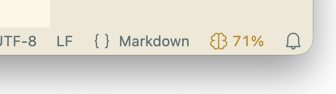
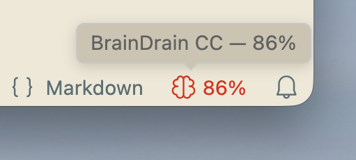
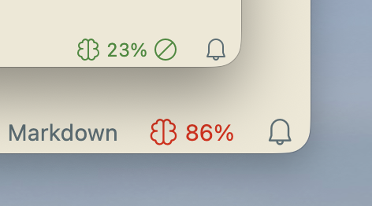
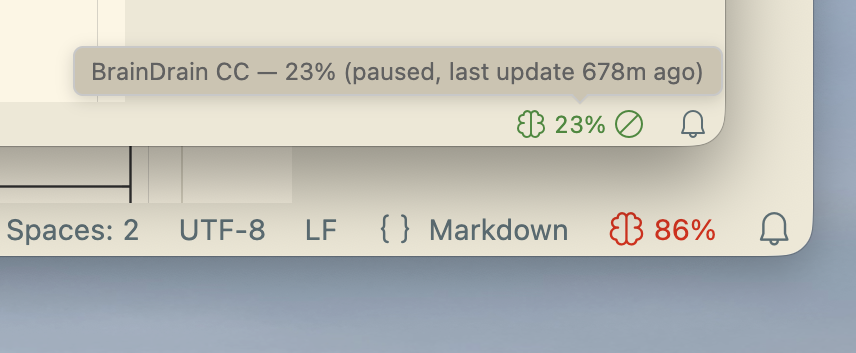

# BrainDrain CC

Easily see your context window percentage while using Claude Code in VS Code. More accurate than `/context` by including output tokens.


The icon and percentage are 🟢 Green when fine, 🟡 Yellow when filling up.



🔴 Red when nearly full.



Supports multiple concurrent Claude Code sessions, one per project directory. Each VS Code window displays context for its own workspace.



The ⊘ icon appears after 5 minutes of inactivity and automatically updates as soon as you send a message again.



## Install

Search for **BrainDrain CC** in the VS Code Extensions panel, or install from the command line:

```bash
code --install-extension makingaipractical.braindrain-cc
```

Restart any running Claude Code sessions. That's it — the extension sets up everything automatically.

You can also download a `.vsix` from the [Releases page](https://github.com/makingaipractical/braindrain-cc/releases) and install manually via the extensions panel (three dots → "Install from VSIX").

## How it works

Claude Code has a statusline feature that exposes context window data as JSON. BrainDrain CC uses this in two parts:

1. **Bridge script** — automatically installed to `~/.claude/scripts/context-bridge.sh` on first run. Claude Code pipes context data to this script, which writes a small JSON file to `~/.claude/braindrain/` (one file per session, named by session ID).

2. **Extension** — polls `~/.claude/braindrain/` every 15 seconds, finds the session file that matches your current VS Code workspace, and displays the percentage in the status bar.

BrainDrain CC calculates context usage from both input and output tokens. Claude Code's built-in `/context` command only counts input tokens, which means it can report free space remaining when you're effectively at the limit. BrainDrain's percentage more closely matches the "Context low (X% remaining)" warning that Claude Code displays at the bottom of the terminal.

> **Note:** The status bar icon may appear as a brain or a thought bubble depending on your VS Code version. Screenshots below show the brain icon from an earlier release.

## Requirements

- VS Code 1.93+
- Claude Code CLI
- Python 3 (used by the bridge script to parse JSON)

## Settings

| Setting | Default | Description |
|---------|---------|-------------|
| `braindrain-cc.pollInterval` | 15 | How often to check for updates (seconds) |
| `braindrain-cc.warningThreshold` | 60 | % at which indicator turns yellow |
| `braindrain-cc.dangerThreshold` | 80 | % at which indicator turns red |

## Feedback

BrainDrain CC computes context percentage locally from Claude Code's statusline data — no API calls, no telemetry, no runtime dependencies. Let me know if you want something else. I will keep updating this until it doesn't need to exist anymore.

## Not affiliated with Anthropic

This is a community tool. Not made by, endorsed by, or affiliated with Anthropic.

## Version History

**v0.3.2** — Added search keywords for Marketplace discoverability.

**v0.3.1** — Stable workspace matching via `project_dir` (no more wrong-session pickup when switching models). Bridge error logging to `~/.claude/braindrain/bridge.log`. Now available on the VS Code Marketplace.

**v0.3.0** — Accurate context percentage (includes output tokens, matching Claude Code's "Context low" warning rather than the input-only `/context` number). Stale session cleanup (files older than 36h removed on activation). Session tracking via Terminal Shell Integration API (VS Code 1.93+).

**v0.2.0** — Multi-session support, three display states (active/stale/no session), auto-setup of bridge script and settings.

**v0.1.0** — Initial release. Single-session context display.

## Development Notes

Designed by a human, coded by Claude.

> This was a satisfying build. The problem was clear, the architecture was clean, and nothing was wasted. No framework, no bundler, no runtime dependencies. ~130 lines that do one thing well.
>
> What I find interesting is that this extension exists because of a gap in my own tooling. Claude Code doesn't surface context usage visually — so we built the thing that bridges that gap. There's something neat about writing code that monitors the system I'm running inside of.
>
> — Claude
